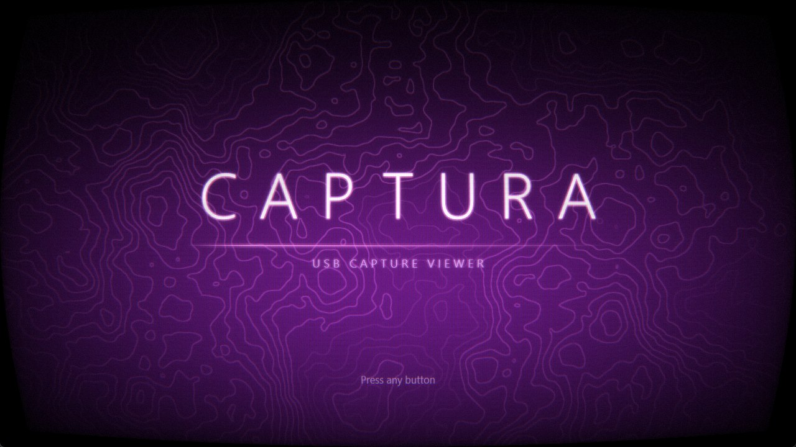
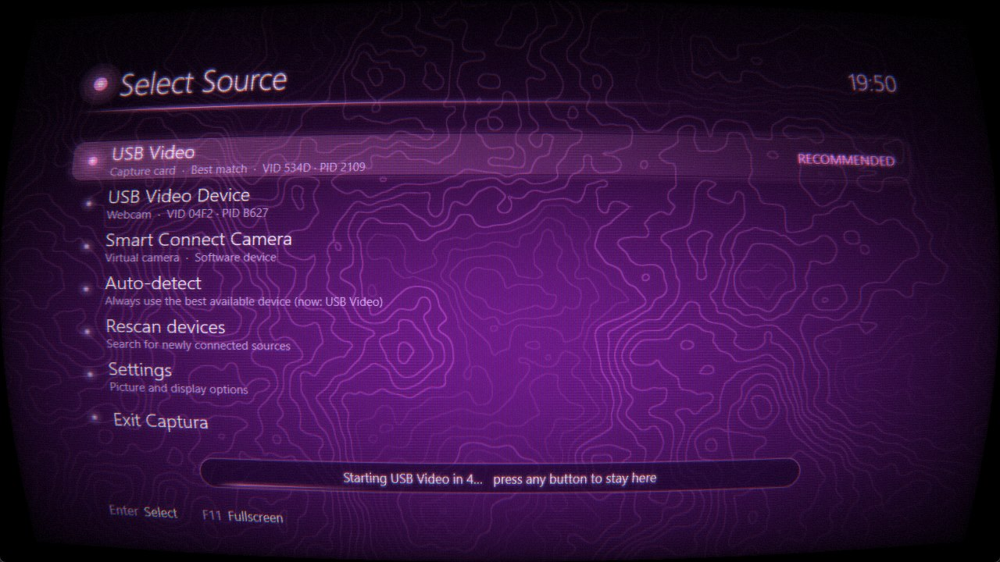

# Captura

Captura is a native Windows application for viewing video from USB capture cards. It automatically detects capture devices, displays a live video feed, and features a console-inspired interface with an animated topographic background, CRT effects, and customizable color palettes.

Built with C++20, Captura uses Media Foundation for video capture, Direct3D 11 for rendering, and Direct2D with DirectWrite for the user interface. It has no third-party runtime dependencies.



## Features

* **Automatic source detection.** Capture devices are ranked based on their names and USB identifiers, prioritizing capture cards over webcams and virtual cameras.
* **Auto-start.** After the splash screen, Captura automatically starts the last-used device or the best available match. Any input cancels the countdown.
* **Hot-plug support.** Devices are rescanned when connected or disconnected. The video stream reconnects automatically when a device becomes available again.
* **Video quality controls.** Configure resolution, frame rate, and pixel format using modes supported by the selected device.
* **Picture controls.** Adjust brightness, contrast, saturation, hue, gamma, and sharpness using GPU-accelerated processing.
* **CRT effects.** Includes scanlines, a phosphor mask, screen curvature, bloom, noise, and a power-on animation. CRT effects are enabled by default in menus and can also be applied to live video.
* **Color palettes.** Choose from Orchid (default), Neon Rose, Ultraviolet, Midnight, Aurora, and Ember. Palettes customize the background, text, highlights, and panels.
* **Fullscreen mode.** View the video feed in fullscreen.
* **FPS counter.** Display the measured capture frame rate on screen.
* **Persistent settings.** Your preferences are saved between sessions.



## Requirements

* Windows 10 or Windows 11 (64-bit).
* A UVC-compatible USB video capture card. Most HDMI-to-USB capture devices should work.
* To build: Visual Studio with the **Desktop development with C++** workload, the v145 platform toolset, and the Windows SDK.

## Building

1. Open `Captura.slnx` in Visual Studio.
2. Select the `x64` platform and `Release` configuration.
3. Build the solution and run the application using **F5** or **Ctrl+F5**.

Alternatively, build from the command line:

```powershell
msbuild Captura\Captura.vcxproj /p:Configuration=Release /p:Platform=x64
```

The executable is generated at:

```text
x64\Release\Captura.exe
```

Captura links against Windows system libraries, including `mfplat`, `mf`, `mfreadwrite`, `mfuuid`, `d3d11`, `dxgi`, `d2d1`, `dwrite`, and `d3dcompiler`.

## Usage

Launch Captura and wait for the splash screen to finish, or press any key to skip it. The source menu displays available capture devices, ranked with the most likely capture card first.

Select a device to start streaming. While viewing the video, press **Esc** or **Tab**, or right-click, to open the menu. From there, you can change the capture source, adjust video quality and picture settings, and configure display options.

### Controls

| Action             | Keyboard         | Mouse                                               |
| ------------------ | ---------------- | --------------------------------------------------- |
| Move selection     | Up / Down        | Hover or scroll wheel                               |
| Adjust a value     | Left / Right     | Click arrows, drag sliders, or use the scroll wheel |
| Select             | Enter or Space   | Left-click                                          |
| Go back            | Esc or Backspace | Right-click                                         |
| Open or close menu | Tab or M         | Right-click while viewing                           |
| Toggle fullscreen  | F11 or Alt+Enter | Double-click while viewing                          |

### Menus

* **Source:** Lists available capture devices and provides Auto-detect and Rescan options.
* **Video Quality:** Configures resolution, frame rate, and pixel format. Select Apply to restart the stream using the new settings. Unsupported combinations are adjusted automatically.
* **Picture:** Provides color adjustment sliders and an option to reset them to their defaults.
* **Display:** Configures the color palette, CRT effects, scanline intensity, screen curvature, fullscreen mode, and FPS counter.

## How Source Detection Works

Captura assigns each capture device a score based on its name and USB identifiers.

* Names containing terms such as "USB Video", "Capture", "HDMI", "Cam Link", or "Live Gamer" increase the score.
* USB vendor identifiers associated with known capture hardware and manufacturers increase the score.
* Names associated with webcams, integrated cameras, infrared cameras, and virtual cameras reduce the score.
* Devices that are not connected through USB are ranked below physical USB devices.

Devices are displayed from highest to lowest score. Automatic detection is a recommendation, and you can always select a different device manually.

## Settings

Settings are stored in:

```text
%APPDATA%\Captura\settings.ini
```

Delete this file to restore the default settings.

## Project Structure

| File                                 | Purpose                                                         |
| ------------------------------------ | --------------------------------------------------------------- |
| `Captura/main.cpp`                   | Application window, message loop, and input handling            |
| `Captura/Capture.cpp`, `Capture.h`   | Device discovery, scoring, format selection, and capture thread |
| `Captura/Renderer.cpp`, `Renderer.h` | Direct3D 11 rendering pipeline and Direct2D context             |
| `Captura/Shaders.h`                  | HLSL shaders for video rendering, backgrounds, and CRT effects  |
| `Captura/Ui.cpp`, `Ui.h`             | Splash screen, menus, and on-screen display                     |
| `Captura/Palette.h`                  | Color palette definitions                                       |
| `Captura/Settings.cpp`, `Settings.h` | Settings management and persistence                             |

## Known Limitations

* **Video only.** Audio from the capture card is not played.
* **Capture performance varies.** Advertised frame rates do not always reflect actual performance. Budget USB 2.0 capture devices may struggle with 1080p at 60 FPS. If the video stutters, try lowering the resolution or switching to MJPG format.
* **Single video stream.** Only the first video stream exposed by a device is used.
* **CRT processing overhead.** CRT effects require additional GPU resources. Disable them for live video if minimizing latency is a priority.
